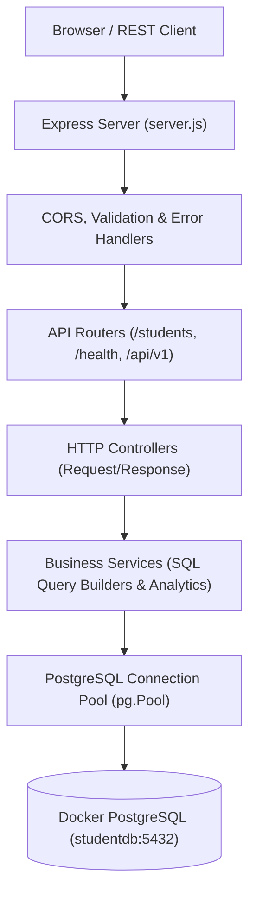

# 🎓 EduManage Pro — Modern Student Management System

A production-grade, full-stack Student Management and Academic Insights System built with **Node.js**, **Express**, and **PostgreSQL** in **Docker**.

---

## 🌟 Key Highlights

* **Layered Architecture**: Clear Separation of Concerns (Routes &rarr; Controllers &rarr; Services &rarr; Database Pool &rarr; Centralized Middleware).
* **Robust PostgreSQL Schema**: Relational database modeling with departments, courses, enrollments, foreign key cascades, and high-performance B-tree indexes.
* **Complete Student CRUD**: Parameterized SQL queries preventing SQL injection with clean status codes (`200`, `201`, `400`, `404`, `409`, `500`).
* **Advanced Query Engine**: Real-time multi-criteria filtering, search-as-you-type (`ILIKE`), field sorting, and pagination.
* **Transparent Academic Insights**: Data analysis layer computing enrollment distributions, average GPAs, cohort metrics, and actionable recommendations.
* **Responsive Modern UI**: Single-page application with dark/light theme, Chart.js visualizations, student profile modal, and toasts.
* **Health & Diagnostics**: Real-time database connection monitoring and uptime reporting at `/health`.
* **Automated Integration Test Suite**: 13 automated tests runnable anytime via `npm test`.

---

## 🏛️ System Architecture



---

## 📁 Project Structure

```
E:\student-management\
├── server.js               # Main Express application entry point
├── db.js                   # Backward-compatible database pool export
├── test.js                 # 13-test automated integration test suite
├── package.json            # Project dependencies and npm scripts
├── .env                    # Local environment variables
├── .env.example            # Safe environment template
├── .gitignore              # Git ignore rules
│
├── src/
│   ├── config/
│   │   └── db.js           # PostgreSQL connection pool configuration
│   ├── routes/
│   │   ├── studentRoutes.js # Student CRUD, search, filter, and insights routes
│   │   ├── healthRoutes.js  # System health check route (/health)
│   │   ├── lookupRoutes.js  # Department and course lookups
│   │   └── authRoutes.js    # Login, registration, and user profile routes
│   ├── controllers/
│   │   ├── studentController.js
│   │   ├── healthController.js
│   │   ├── lookupController.js
│   │   └── authController.js
│   ├── services/
│   │   ├── studentService.js    # Parameterized SQL queries for students
│   │   ├── analyticsService.js  # Transparent data analysis and recommendations
│   │   ├── exportService.js     # RFC 4180 CSV and PDF document generators
│   │   ├── authService.js       # Bcrypt password hashing & JWT generation
│   │   ├── cacheService.js      # Redis in-memory cache layer with graceful fallback
│   │   └── emailService.js      # Responsive HTML welcome notifications via Nodemailer
│   ├── middleware/
│   │   ├── validate.js          # Input validation for student payloads
│   │   ├── errorHandler.js      # Centralized error and conflict handling
│   │   ├── security.js          # Helmet protection headers & rate limiting
│   │   └── auth.js              # JWT Bearer verification & Role-Based Access (RBAC)
│   ├── docs/
│   │   └── swaggerSpec.js       # OpenAPI 3.0.0 interactive specification
│   └── database/
│       └── migrate.js           # Safe, non-destructive migration script
│
└── public/                 # Modern Frontend Dashboard
    ├── index.html          # Responsive single-page application layout
    ├── css/
    │   └── style.css       # Design system with dark/light mode and animations
    └── js/
        ├── api.js          # Reusable client API fetch wrapper
        └── app.js          # UI controller, charts, modals, and event bindings
```

---

## 🚀 Getting Started

### 1. Prerequisites
* **Node.js** (v18 or higher)
* **Docker Desktop** (running on your machine)

### 2. Docker PostgreSQL Container Setup
Ensure Docker Desktop is running and the database container is active on port `5432`:
```powershell
docker run -d --name postgres-db -p 5432:5432 -e POSTGRES_PASSWORD=1234 -e POSTGRES_DB=studentdb postgres
```

> [!IMPORTANT]
> **Windows Port 5432 Conflict Note**:
> If a native Windows PostgreSQL service (`postgresql-x64-18`) is installed, make sure it is stopped to prevent intercepting port `5432`:
> ```powershell
> Stop-Service postgresql-x64-18; Set-Service postgresql-x64-18 -StartupType Manual
> ```

### 3. Environment Variables
Configure your `.env` file in the project root (see `.env.example`):
```env
PORT=3000
NODE_ENV=development

DB_USER=postgres
DB_HOST=127.0.0.1
DB_NAME=studentdb
DB_PASSWORD=1234
DB_PORT=5432
```

### 4. Run Database Migrations
Enhance database tables and seed initial courses and departments while preserving existing student records:
```powershell
npm run migrate
```

### 5. Run Automated Tests
Execute the 13 automated integration tests:
```powershell
npm test
```

### 6. Start the Server
```powershell
npm start
```

Access the application in your browser:
* 🌐 **Web Dashboard**: `http://localhost:3000`
* 📑 **Interactive Swagger API Docs**: `http://localhost:3000/api-docs`
* 📋 **OpenAPI 3.0 JSON Schema**: `http://localhost:3000/api-docs.json`
* 💚 **Health Status**: `http://localhost:3000/health`

### 7. Full One-Command Launch with Docker Compose
Alternatively, run both the Node.js API server, PostgreSQL container, and Redis cache together:
```powershell
docker compose up --build
```
* **Stop containers**: `docker compose down`

---

## ☁️ Cloud Deployment Blueprints (1-Click Hosting)

### Deploy to Render.com
1. Sign up at [render.com](https://render.com) and link your GitHub repository.
2. Render automatically reads [`render.yaml`](file:///E:/student-management/render.yaml):
   * Provisions managed **PostgreSQL 18** (`edumanage-postgres`)
   * Provisions managed **Redis 7** (`edumanage-redis`)
   * Automatically executes migrations and boots the Node.js API (`npm run deploy`)

### Deploy to Railway.app
1. Sign up at [railway.app](https://railway.app).
2. Click **New Project** &rarr; **Deploy from GitHub repo**.
3. Railway automatically detects [`railway.json`](file:///E:/student-management/railway.json) and [`Dockerfile`](file:///E:/student-management/Dockerfile).
4. Add PostgreSQL and Redis plugins with 1 click in the Railway dashboard.


---

## 📚 REST API Reference

### System & Documentation
| Method | Endpoint | Description |
| :--- | :--- | :--- |
| `GET` | `/` | Web Dashboard or service greeting |
| `GET` | `/health` | Server uptime and PostgreSQL connection latency |
| `GET` | `/api-docs` | Interactive Swagger UI (try out endpoints in browser) |
| `GET` | `/api-docs.json` | Raw OpenAPI 3.0.0 specification JSON |

### Authentication & RBAC (Role-Based Access Control)
| Method | Endpoint | Description | Access Level |
| :--- | :--- | :--- | :--- |
| `POST` | `/auth/login` | User login (returns 24-hr Bearer JWT token) | Public |
| `POST` | `/auth/register` | Register new user account (default role: `Student`) | Public |
| `GET` | `/auth/me` | Fetch authenticated user profile | Bearer Token |

> **Default Demo Accounts**:
> * **Admin**: `admin` / `admin123` (Full CRUD privileges)
> * **Student**: `student` / `student123` (Read-only student directory)

### Students API
| Method | Endpoint | Description | Access Level |
| :--- | :--- | :--- | :--- |
| `GET` | `/` | Root service greeting | Public |
| `GET` | `/students` | All students (supports search, filters & pagination) | Public |
| `GET` | `/students/:id` | Single student with department & enrolled courses | Public |
| `POST` | `/students` | Register a new student (validated) | **Admin Only** (JWT) |
| `PUT` | `/students/:id` | Update an existing student | **Admin Only** (JWT) |
| `DELETE` | `/students/:id` | Delete a student | **Admin Only** (JWT) |
| `GET` | `/students/insights`| Statistical summary, distributions & recommendations | Public |
| `GET` | `/students/export/csv`| Download student directory as RFC 4180 CSV spreadsheet | Public |
| `GET` | `/students/export/pdf`| Stream formatted institutional academic report PDF | Public |

---

## 📋 API Request & Response Examples

### 1. Register a Student (`POST /students`)
**Request Body:**
```json
{
  "name": "Arjun Mehta",
  "email": "arjun.mehta@univ.edu",
  "age": 22,
  "course": "CSE",
  "phone": "9876543219",
  "gpa": 3.85,
  "status": "Active",
  "department_id": 1
}
```

**Response (`201 Created`):**
```json
{
  "success": true,
  "message": "Student registered successfully.",
  "data": {
    "id": 11,
    "name": "Arjun Mehta",
    "email": "arjun.mehta@univ.edu",
    "age": 22,
    "course": "CSE",
    "gpa": "3.85",
    "status": "Active"
  }
}
```

### 2. Validation Error (`400 Bad Request`)
```json
{
  "success": false,
  "message": "Validation failed.",
  "errors": [
    "A valid email address is required.",
    "Age must be an integer between 15 and 100."
  ]
}
```

### 3. Student Not Found (`404 Not Found`)
```json
{
  "message": "Student not found"
}
```

### 4. Search & Pagination Query
```http
GET /students?search=Rahul&course=CSE&page=1&limit=10&sort_by=name&order=ASC
```

---

## 🧪 Testing Verification Summary
 
All 26 integration tests pass:
```
==================================================
🧪 Starting Automated Test Suite for EduManage Pro
🎯 Testing Server at: http://localhost:3000
==================================================
  ✅ PASS: GET / returns welcome message
  ✅ PASS: GET /health reports UP, connected database, and cache status
  ✅ PASS: Redis Cache: Second GET /students serves sub-millisecond cached data
  ✅ PASS: Security Headers: Helmet sets protection headers
  ✅ PASS: Rate Limiting: API requests receive RateLimit headers
  ✅ PASS: GET /api-docs/ serves interactive Swagger UI
  ✅ PASS: GET /api-docs.json exports valid OpenAPI 3.0 schema
  ✅ PASS: GET /students returns array of students
  ✅ PASS: GET /students/1 returns student #1 (Rahul)
  ✅ PASS: GET /students/999 returns 404 with exact message
  ✅ PASS: GET /students?search=Rahul filters by name
  ✅ PASS: GET /students?course=CSE filters by course
  ✅ PASS: GET /students?page=1&limit=2 returns paginated metadata
  ✅ PASS: GET /students/insights returns transparent analytics
  ✅ PASS: POST /auth/login with valid admin credentials returns JWT token
  ✅ PASS: POST /auth/login with valid student credentials returns Student token
  ✅ PASS: POST /auth/login rejects incorrect password with 401 Unauthorized
  ✅ PASS: GET /auth/me returns authenticated user profile with Bearer token
  ✅ PASS: RBAC: POST /students rejects unauthenticated request with 401
  ✅ PASS: RBAC: POST /students rejects Student role with 403 Forbidden
  ✅ PASS: POST /students rejects invalid input with 400 Bad Request
  ✅ PASS: POST /students registers a valid new student
  ✅ PASS: Email Notification: Dispatches styled HTML welcome notification on student registration
  ✅ PASS: PUT /students/:id updates student attributes
  ✅ PASS: DELETE /students/:id deletes student
  ✅ PASS: GET /students/export/csv downloads RFC 4180 CSV spreadsheet
  ✅ PASS: GET /students/export/pdf streams valid binary PDF report
==================================================
📊 Test Summary: 27 Passed | 0 Failed
==================================================
```
