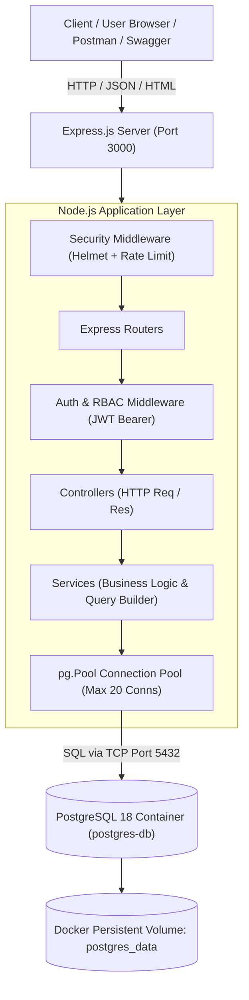

# 📘 EduManage Pro — Master Architecture & Operations Runbook

A complete reference guide covering architecture, operations, security, API specifications, and deployment runbooks for the **EduManage Pro** Student Management System.

---

## 🏛️ 1. System Architecture



### Component Responsibilities
| Component | Path | Responsibility |
| :--- | :--- | :--- |
| **Server Entry** | [`server.js`](file:///E:/student-management/server.js) | Configures middlewares, mounts routes, serves UI & Swagger, boots port 3000. |
| **Database Pool** | [`src/config/db.js`](file:///E:/student-management/src/config/db.js) | Maintains reusable `pg.Pool` connection pool with timeout safety. |
| **Database Migration** | [`src/database/migrate.js`](file:///E:/student-management/src/database/migrate.js) | Non-destructive DDL migrations, relational indexes, and account seeds. |
| **Auth Middleware** | [`src/middleware/auth.js`](file:///E:/student-management/src/middleware/auth.js) | Verifies JWT tokens (`authenticateToken`) and enforces roles (`requireRole`). |
| **Security Middleware** | [`src/middleware/security.js`](file:///E:/student-management/src/middleware/security.js) | Helmet HTTP headers & sliding-window rate limiters. |
| **Export Service** | [`src/services/exportService.js`](file:///E:/student-management/src/services/exportService.js) | Formats RFC 4180 CSV spreadsheets and streams vector PDF reports. |
| **Testing Suite** | [`test.js`](file:///E:/student-management/test.js) | 25 automated integration tests validating health, CRUD, auth, and exports. |

---

## 🚀 2. Quick-Start Commands

### 1. Start the PostgreSQL Database (Docker)
```powershell
# Option A: Start existing container
docker start postgres-db

# Option B: Spin up multi-container environment via Docker Compose
docker compose up -d postgres
```

### 2. Run Database Migrations & Seeding
```powershell
npm run migrate
```
*Creates `students`, `departments`, `courses`, `enrollments`, and `users` tables, generates B-tree indexes, and seeds default records.*

### 3. Start the Application Server
```powershell
npm start
```
*Server runs on [http://localhost:3000](http://localhost:3000).*

### 4. Run the 25-Test Automated Suite
```powershell
npm test
```

---

## 🔑 3. Authentication & User Accounts (RBAC)

The system enforces **Role-Based Access Control** via JSON Web Tokens (JWT).

### Pre-Seeded Accounts
| Username | Email | Password | Role | Privileges |
| :--- | :--- | :--- | :--- | :--- |
| `admin` | `admin@edumanage.local` | `admin123` | **Admin** | Full CRUD, can register/update/delete students. |
| `student` | `student@edumanage.local` | `student123` | **Student** | Read-only directory, insights, and report exports. |

### How to Log In & Authenticate via CLI
```powershell
# 1. Authenticate and extract token
$response = Invoke-RestMethod -Uri "http://localhost:3000/auth/login" -Method Post -Body '{"username":"admin","password":"admin123"}' -ContentType "application/json"
$token = $response.token

# 2. Use token for Admin-restricted endpoints (e.g. create student)
Invoke-RestMethod -Uri "http://localhost:3000/students" -Method Post -Headers @{ Authorization = "Bearer $token" } -Body '{"name":"New Student","email":"new@school.edu","age":21,"course":"CSE"}' -ContentType "application/json"
```

---

## 📋 4. REST API Master Matrix

| Method | Endpoint | Access Level | Description |
| :--- | :--- | :--- | :--- |
| `GET` | `/` | Public | Web Dashboard (browser) or service status text |
| `GET` | `/health` | Public | Health diagnostic probe (Uptime & DB status) |
| `GET` | `/api-docs` | Public | Interactive Swagger UI documentation |
| `GET` | `/api-docs.json` | Public | Raw OpenAPI 3.0.0 specification JSON |
| `POST`| `/auth/login` | Public | Authenticate user & obtain 24-hr JWT token |
| `POST`| `/auth/register` | Public | Register new user account (default: `Student`) |
| `GET` | `/auth/me` | Bearer Token | Fetch authenticated user profile |
| `GET` | `/students` | Public | List students (search, filter, sort, paginate) |
| `GET` | `/students/:id` | Public | Detailed student profile with courses & dept |
| `POST`| `/students` | **Admin Only** | Register student (validates name, email, age) |
| `PUT` | `/students/:id` | **Admin Only** | Update student attributes (validated) |
| `DELETE`| `/students/:id` | **Admin Only** | Delete student record |
| `GET` | `/students/insights` | Public | Academic performance statistics & analytics |
| `GET` | `/students/export/csv` | Public | Download student directory as CSV spreadsheet |
| `GET` | `/students/export/pdf` | Public | Stream formatted institutional PDF report |
| `GET` | `/api/v1/departments` | Public | List academic departments |
| `GET` | `/api/v1/courses` | Public | List course catalog with credits |

---

## 🛡️ 5. Security & Protection Matrix

1. **Helmet HTTP Headers**:
   - `X-Content-Type-Options: nosniff`: Prevents MIME confusion attacks.
   - `X-Frame-Options: SAMEORIGIN`: Neutralizes clickjacking risks.
   - `Strict-Transport-Security (HSTS)`: Enforces HTTPS communication.
   - `Content-Security-Policy (CSP)`: Curated policy permitting Google Fonts, Chart.js CDN, and Swagger UI inline resources.
2. **Rate Limiting**:
   - General API: **300 requests / 15 mins** (`apiLimiter`).
   - Write/Mutations (`POST`, `PUT`, `DELETE`): **50 requests / 15 mins** (`writeLimiter`).
   - Returns RFC standard `RateLimit-Limit`, `RateLimit-Remaining`, and `RateLimit-Reset` headers.
3. **SQL Injection Defense**:
   - 100% of database queries execute with parameterized statements (`$1, $2`). User input is never concatenated into raw SQL strings.

---

## 🐳 6. Docker & CI/CD Pipeline

### Production Docker Container
- **Base**: `node:20-alpine` (lightweight, minimal attack surface).
- **User**: Runs under the unprivileged `node` user.
- **Health Check**: Automated periodic probe via `wget http://localhost:3000/health`.

### Build & Run Manually with Docker
```powershell
# Build image
docker build -t student-management-api .

# Run container linked to host network or Docker bridge
docker run -d --name my-api -p 3000:3000 --env-file .env student-management-api
```

### GitHub Actions Workflow (`.github/workflows/ci.yml`)
Every `git push` or pull request automatically executes:
1. Spins up a `postgres:18-alpine` service container with ready probes.
2. Sets up Node.js 20 LTS with cached dependencies.
3. Runs `npm ci` for deterministic dependency installation.
4. Executes database migrations (`node src/database/migrate.js`).
5. Boots the Node server and polls `/health` until ready.
6. Runs all 25 automated integration tests (`npm test`).
7. Builds the Docker container to verify deployment readiness.

---

## 🔧 7. Troubleshooting & Operational Tips

### Issue 1: Port 5432 Collision on Windows
* **Symptom**: `connect ECONNREFUSED 127.0.0.1:5432` or `address already in use`.
* **Cause**: Windows may have native PostgreSQL installed (`postgresql-x64-18`) conflicting with Docker port 5432.
* **Fix**: Ensure the native Windows service is stopped so Docker owns port 5432:
  ```powershell
  Stop-Service -Name "postgresql-x64-18" -Force
  docker start postgres-db
  ```

### Issue 2: Docker Backend Engine Downtime
* **Symptom**: `open //./pipe/dockerDesktopLinuxEngine: The system cannot find the file specified`.
* **Fix**: Launch the Docker backend in user mode:
  ```powershell
  & "C:\Program Files\Docker\Docker\resources\com.docker.backend.exe"
  ```

### Issue 3: Rate Limited (HTTP 429)
* **Symptom**: `{"success": false, "message": "Too many requests..."}`
* **Fix**: The rate limit window resets after 15 minutes. Inspect the `RateLimit-Reset` response header to view remaining seconds.
